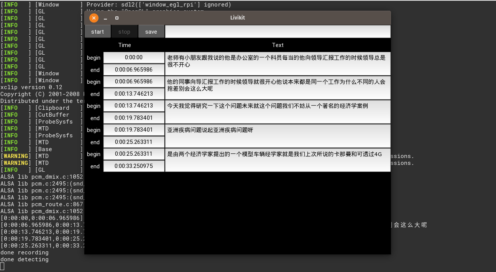

# livikit
A media editor made for my good friends

## Requirements

- python3.6+
- certifi==2020.4.5.2
- chardet==3.0.4
- docutils==0.16
- idna==2.9
- Kivy==1.11.1
- Kivy-Garden==0.1.4
- numpy==1.18.5
- PyAudio==0.2.11
- Pygments==2.6.1
- requests==2.23.0
- SpeechRecognition==3.8.1
- urllib3==1.25.9

```bash
pip install -r requirements.txt
```

## How to run

```bash
python gui.py
```


